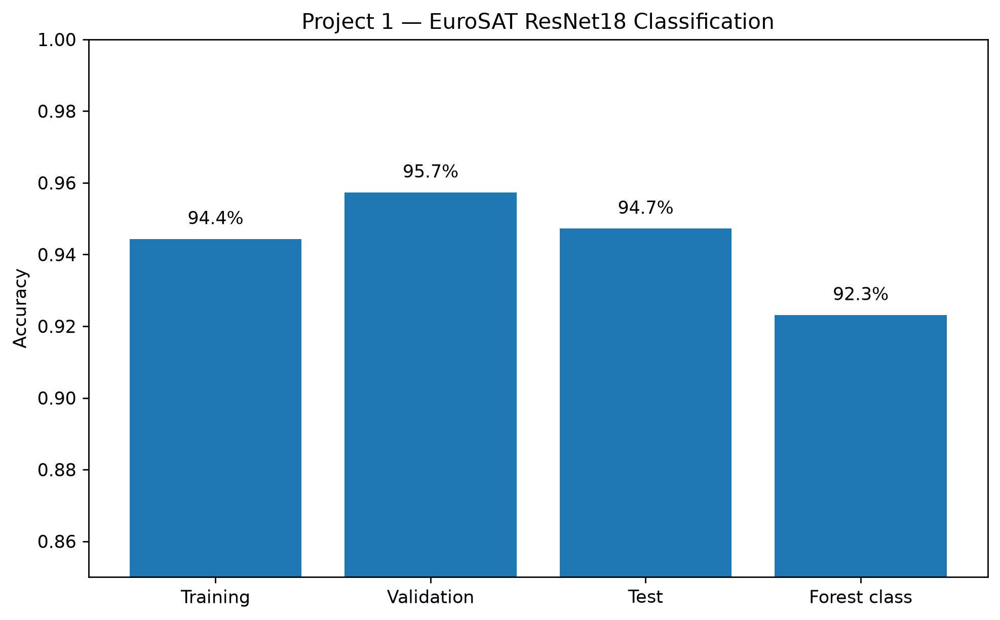
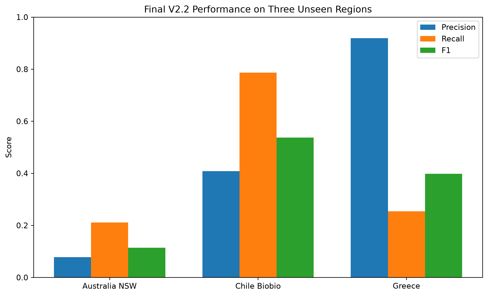

# Forest Loss Detection from Satellite Imagery

A machine learning project for detecting forest loss from satellite imagery. Progressing from a simpler EuroSAT land-use classification, to a multispectral Siamese U-Net trained on paired Sentinel-2 imagery from 2018 and 2025.

The final model performs pixel-level forest-loss segmentation, using six Sentinel-2 spectral bands and Hansen Global Forest Change labels across geographically diverse regions.


## Project Overview

This project began with a ResNet18 model, but the last layer was forgoten to train it on EuroSAT for land-use classification.

That first model achieved strong classification accuracy, but using land-cover classifications heuristically to detect forest loss didn't generalize well across different geographic regions.

The project was then redesigned as a dedicated change-detection problem using a Siamese U-Net.

### Final system

- **Input:** paired Sentinel-2 imagery from 2018 and 2025
- **Bands:** B2, B3, B4, B8, B11, B12
- **Model:** Siamese U-Net with shared encoder
- **Output:** pixel-level forest-loss probability map
- **Labels:** Hansen Global Forest Change
- **Training regions:** 30
- **Training patches:** 10,303
- **Validation regions:** 2
- **Held-out test regions:** 3
- **Patch size:** 128 × 128 pixels

---

## Project Evolution

### 1. EuroSAT Classification Baseline

The first stage used EuroSAT to train a pretrained ResNet18 model on 10 land-use classes.

- 27,000 RGB satellite image tiles
- 10 classes
- 70 / 15 / 15 train-validation-test split
- Test accuracy: 94.72%
- Forest-class accuracy: 92.31%



The classifier was then applied to imagery from different years as an initial forest-loss detector.

This worked as a proof of concept, but when it was validated with the Hansen Global Forest Change mask, it showed poor performance with unseen regions, especially outside Europe.

This is mainly because the EuroSTAT data contained only European images, making it better suited for continent specific classification. Furthermore, ResNet18 wasn't trained directly for change detection, it was trained for class>

---

### 2. Siamese U-Net Change Detection

The second stage replaced heuristic classification with direct pixel-level segmentation.

The model receives two multispectral Sentinel-2 images from different years and learns where forest loss occurred between them.

Key improvements included:

- paired 2018 and 2025 imagery
- six spectral bands instead of RGB only
- shared Siamese encoder
- U-Net decoder
- synchronized data augmentation
- training-only per-band normalization
- region-balanced sampling
- change-balanced sampling
- BCE + Tversky loss
- learning-rate scheduling
- early stopping
- validation-based threshold tuning

---

## Model and Training Approach

The Siamese U-Net processes the 2018 and 2025 images through the same encoder. Features extracted from the two dates are compared using absolute differences, and a U-Net decoder converts those differences into a pixel-level forest-loss probability map.


The final model uses six Sentinel-2 spectral bands:

| Band | Information           |
| ---- | --------------------- |
| B2   | Blue                  |
| B3   | Green                 |
| B4   | Red                   |
| B8   | Near Infrared         |
| B11  | Short-Wave Infrared 1 |
| B12  | Short-Wave Infrared 2 |

Training included per-band normalization, synchronized rotations and flips, region-balanced sampling, and balancing between low-, medium-, and high-loss patches.

The final model used Binary Cross Entropy + Tversky Loss with:
α = 0.4
β = 0.6

A validation-only threshold sweep selected a final probability threshold of 0.15.

---

## Dataset Expansion and Model Iterations

The first Siamese U-Net was trained on only 6 regions and 1,734 patches.

Although it reached approximately 0.70 validation F1, it generalized very poorly to some unseen landscapes.

The dataset was therefore expanded substantially:

|                    | Initial Siamese | Final Model |
| ------------------ | --------------: | ----------: |
| Training regions   |               6 |          30 |
| Training patches   |           1,734 |      10,303 |
| Validation regions |               1 |           2 |
| Spectral bands     |               6 |           6 |

This added **8,569 training patches**, increasing the training dataset by approximately **5.9×** and the number of geographic training regions by **5×**.

Validation was performed separately on Sweden (Central) and Spain (Galicia)

At the final threshold of 0.15:

| Validation Region |        F1 |
| ----------------- | --------: |
| Sweden            | **0.639** |
| Spain Galicia     | **0.517** |
| Mean              | **0.578** |

---

## Results

### Key results

| Milestone              |             Result |
| ---------------------- | -----------------: |
| EuroSAT test accuracy  |         **94.72%** |
| Forest-class accuracy  |         **92.31%** |
| Training regions       |         **6 → 30** |
| Training patches       | **1,734 → 10,303** |
| Added training patches |         **+8,569** |
| Training-data increase |           **5.9×** |
| Greece test F1         |  **0.025 → 0.399** |
| Greece test recall     |  **0.012 → 0.254** |
| Chile test F1          |          **0.538** |
| Chile test recall      |          **0.787** |

### Generalization improvement on Greece

The initial Siamese model had high precision on Greece but detected almost none of the real forest loss.

| Metric    | Initial Siamese | Final V2.2 |
| --------- | --------------: | ---------: |
| Precision |           0.914 |  **0.919** |
| Recall    |           0.012 |  **0.254** |
| F1        |           0.025 |  **0.399** |
| IoU       |           0.012 |  **0.249** |

This represents approximately a 16× improvement in F1  and a 20× improvement in recall on the same geographically unseen region.


---

### Held-Out Geographic Tests

The final model was evaluated on three regions that were not used for training or validation.

| Region        | Actual Loss | Precision |    Recall |        F1 |   IoU | Predicted Loss |
| ------------- | ----------: | --------: | --------: | --------: | ----: | -------------: |
| Australia NSW |       0.09% |     0.078 |     0.211 |     0.114 | 0.060 |          0.24% |
| Chile Biobio  |      12.53% |     0.408 |   0.787   |   0.538   | 0.368 |         24.16% |
| Greece        |      45.68% |   0.919   |     0.254 |   0.399   | 0.249 |         12.65% |



The three test regions represent very different forest-loss conditions:

* Australia NSW: extremely low forest-loss prevalence
* Chile Biobio: medium/high forest-loss prevalence
* Greece: very high forest-loss prevalence

Performance varies across these environments, showing that geographic calibration remains one of the main challenges.

---

## Example Predictions

Predictions were generated across 20 geographic regions.

Each example contains:

**2018 Sentinel-2 | 2025 Sentinel-2 | Hansen Ground Truth | Model Prediction | Diagnostic Overlay**

The colours distinguish true positives, false positives, false negatives, and true negatives.

### Sweden — Central — Validation


### Finland — Central — Training


### Germany — Black Forest — Training


### Brazil — Rondonia — Training


### Canada — Alberta — Training


The remaining examples are available in:

[`results/examples/`](results/examples/)

Selected training-region example patches include:

| Region | Patch F1 |
|---|---:|
| Portugal — Central | **0.848** |
| Indonesia — Sumatra | **0.791** |
| Argentina — Misiones | **0.642** |
| Bolivia — Santa Cruz | **0.642** |
| Japan — Hokkaido | **0.574** |
| South Africa — Mpumalanga | **0.524** |

> These are selected patch-level examples intended to visualize model behaviour, not full-region benchmark results.

---

## Key Findings and Limitations

The project highlighted several practical machine-learning challenges.

* **Geographic domain shift:** the initial model reached strong validation performance but failed badly on unseen Greece.
* **Geographic diversity mattered:** expanding from 6 to 30 regions substantially improved generalization.
* **Class imbalance existed at several levels:** between positive and negative pixels, between low- and high-loss patches, and between geographic regions.
* **Threshold calibration mattered:** a threshold of 0.15 performed better than the default 0.50.
* **Different regions fail differently:** Australia is dominated by false-positive sensitivity, Chile tends to overpredict loss, and Greece still underpredicts total loss.

The final model is substantially more robust than the first version, but a single global threshold still does not perform equally well across all landscapes.

Hansen Global Forest Change measures tree-cover loss, which is not necessarily identical to permanent human-caused deforestation. Tree-cover loss can also result from logging, wildfire, storms, natural disturbance, or temporary clearing.

The final dataset is also relatively small compared with production-scale remote-sensing datasets.

---

## Installation

Clone the repository:

```bash
git clone https://github.com/laia-wq/forest-loss-detection.git
cd forest-loss-detection
```

Install the required packages:

```bash
pip install -r requirements.txt
```

Launch Jupyter:

```bash
jupyter lab
```

The raw Sentinel-2 imagery and generated NumPy datasets are not included in the repository because of their size.

---

## Data and Reproducibility

The project uses:

* EuroSAT
* Sentinel-2
* Hansen Global Forest Change

The raw datasets are not committed to GitHub.

Detailed information about preprocessing, geographic splits, data quality, and excluded regions is available in:

[`data/README.md`](data/README.md)

The notebooks contain the model-development and evaluation workflow, but reproducing the complete training process requires regenerating or providing the source satellite imagery.

---

## Technologies

**Machine Learning**

* Python
* PyTorch
* Torchvision
* ResNet18
* Siamese neural networks
* U-Net
* Transfer learning

**Remote Sensing**

* Sentinel-2
* EuroSAT
* Hansen Global Forest Change
* Google Earth Engine
* Rasterio

**Training and Evaluation**

* multispectral normalization
* synchronized augmentation
* region-balanced sampling
* change-balanced sampling
* BCE loss
* Tversky loss
* early stopping
* learning-rate scheduling
* threshold calibration
* geographic holdout evaluation

**Compute**

* NVIDIA DGX Spark
* NVIDIA GB10 GPU

---

## Notebooks

### [1. EuroSAT Classification](notebooks/1_EuroSAT_Classification.ipynb)

Land-use classification baseline using transfer learning with ResNet18.

### [2. Siamese U-Net](notebooks/2_Siamese_UNet.ipynb)

Multispectral change-detection pipeline, geographic dataset expansion, model iterations, validation, and final geographic testing.

---

## Future Improvements

* increase geographic and seasonal diversity
* test pretrained remote-sensing encoders
* improve probability calibration across regions
* use larger spatial context around each prediction
* evaluate additional fully unseen regions
* distinguish temporary tree-cover loss from permanent deforestation
* build a lightweight inference interface for new image pairs
