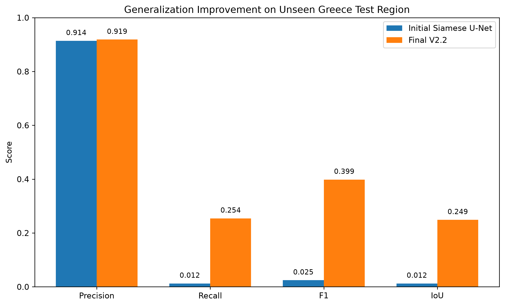
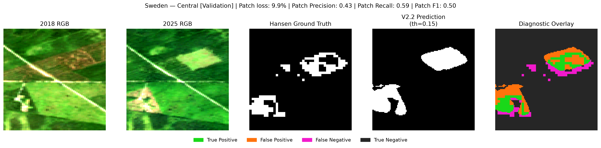
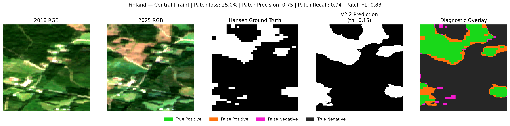
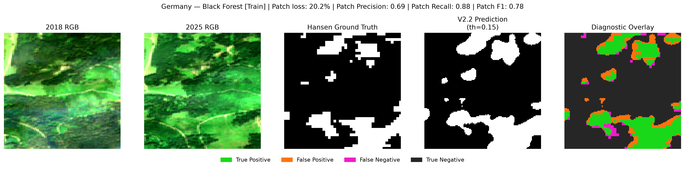
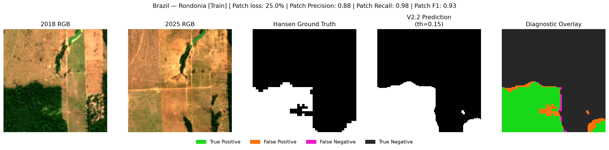
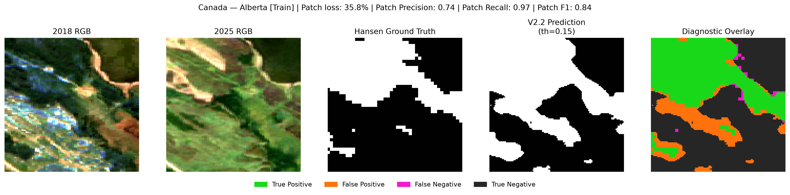

# Forest Loss Detection from Satellite Imagery
A multispectral Siamese U-Net that detects forest loss using Sentinel-2 imagery from 2018 and 2025

## Description
- **Input:** paired Sentinel-2 imagery from 2018 and 2025
- **Bands:** B2, B3, B4, B8, B11, B12
- **Model:** Siamese U-Net with shared encoder
- **Output:** pixel-level forest-loss probability map
- **Labels:** Hansen Global Forest Change
- **Training regions:** 30
- **Training patches:** 10,303
- **Validation regions:** 2
- **Test regions:** 3
- **Patch size:** 128 × 128 pixels

## Background

I started by training a ResNet18 model with EuroSAT's 27,000 64x64 RGB satellite image tiles, which was traditionally used as a land-use classification tool. While it showed high classification accuracy during training (94.72% test accuracy), it performed poorly when its results were compared to Hansen Global Forest Change. So I decided to use a dedicated change-detection model, a Siamese U-Net, to fix many setbacks and improve F1 scores. The Siamese U-Net processes 2018 and 2025 images through the same encoder. Features extracted from the two dates are compared using absolute differences, and a U-Net decoder converts those differences into a pixel-level forest-loss probability map.

Key improvements included:

- paired 2018 and 2025 imagery
- six spectral bands instead of RGB only (RGB, NIR, SWIR1, SWIR2)
- shared Siamese encoder
- U-Net decoder
- synchronized data augmentation
- training-only per-band normalization
- region-balanced sampling
- change-balanced sampling (between low, medium, high-loss patches)
- BCE + Tversky loss (α = 0.4, β = 0.6)
- learning-rate scheduling
- early stopping
- validation-based threshold tuning (final probability threshold=0.15)

The first Siamese U-Net was trained on only 6 regions and 1,734 patches.
Although it reached approximately 0.70 validation F1, it generalized very poorly to some unseen landscapes.

The dataset was therefore expanded substantially:

|                    | Initial Siamese | Final Model |
| ------------------ | --------------: | ----------: |
| Training regions   |               6 |          30 |
| Training patches   |           1,734 |      10,303 |
| Validation regions |               1 |           2 |
| Spectral bands     |               6 |           6 |

This added **8,569 training patches**, increasing the training dataset by approximately **5.9×** and the number of geographic training regions by **5×**.

These features led to improvements such as the following data on Greece:

| Metric    | Initial Siamese | Final Siamese |
| --------- | --------------: | ------------: |
| Precision |           0.914 |     **0.919** |
| Recall    |           0.012 |     **0.254** |
| F1        |           0.025 |     **0.399** |
| IoU       |           0.012 |     **0.249** |

This represents approximately a 16× improvement in F1  and a 20× improvement in recall on the same geographically unseen region.



## Example Predictions

Predictions were generated across 20 geographic regions.

Each example contains:

**2018 Sentinel-2 | 2025 Sentinel-2 | Hansen Ground Truth | Model Prediction | Diagnostic Overlay**

The colours distinguish true positives, false positives, false negatives, and true negatives.

### Sweden — Central — Validation



### Finland — Central — Training



### Germany — Black Forest — Training



### Brazil — Rondonia — Training



### Canada — Alberta — Training



The remaining examples are available in:

[`results/examples/`](results/examples/)

Selected training-region example patches include:

| Region | Patch F1 |
|---|---:|
| Portugal — Central | **0.848** |
| Indonesia — Sumatra | **0.791** |
| Argentina — Misiones | **0.642** |
| Bolivia — Santa Cruz | **0.642** |
| Japan — Hokkaido | **0.574** |
| South Africa — Mpumalanga | **0.524** |

> These are selected patch-level examples intended to visualize model behaviour, not full-region benchmark results.

## Limitations

The final model is substantially more robust than the first version, but a single global threshold still does not perform equally well across all landscapes.

Hansen Global Forest Change measures tree-cover loss, which is not necessarily identical to permanent human-caused deforestation. Tree-cover loss can also result from logging, wildfire, storms, natural disturbance, or temporary clearing.

The final dataset is also relatively small compared with production-scale remote-sensing datasets.

## Installation

Clone the repository:
```bash
git clone https://github.com/laia-wq/forest-loss-detection.git
cd forest-loss-detection
```
Install the required packages:
```bash
pip install -r requirements.txt
```
Launch Jupyter:
```bash
jupyter lab
```

The raw Sentinel-2 imagery and generated NumPy datasets are not included in the repository because of their size.

Detailed information about preprocessing, geographic splits, data quality, and excluded regions is available in:

[`data/README.md`](data/README.md)

The notebooks contain the model-development and evaluation workflow, but reproducing the complete training process requires regenerating or providing the source satellite imagery.

## Technologies

**Core ML:** Python, PyTorch, Torchvision, ResNet18, Siamese U-Net

**Remote Sensing:** Sentinel-2, EuroSAT, Hansen Global Forest Change, Google Earth Engine, Rasterio

**Training:** multispectral normalization, synchronized augmentation, region/change-balanced sampling, BCE + Tversky loss, early stopping, learning-rate scheduling, threshold calibration

**Compute:** NVIDIA DGX Spark, NVIDIA GB10 GPU
## Notebooks

### [1. EuroSAT Classification](notebooks/1_EuroSAT_Classification.ipynb)

Land-use classification baseline using transfer learning with ResNet18.

### [2. Siamese U-Net](notebooks/2_Siamese_UNet.ipynb)

Multispectral change-detection pipeline, geographic dataset expansion, model iterations, validation, and final geographic testing.


